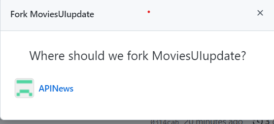
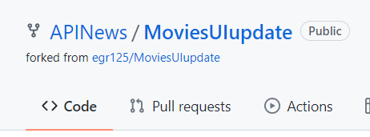


# Setup

## Requirements

* Visual studio or Visual Studio Code
* Net Core Version 5 (will be auto installed when project is opened)

# Download Codebase

Here you need to fork the project to your own Git Account. The fork button is on the top right of 
Movies UI repo

A popup will appear asking you where you want to fork to - sent it to your own personal account

After clicking on your account it should then redirect to the forked repo. You should then see the following in the top right of the screen:(again your account name will show)

## Running the project

Run the project through IIS Express.

# Running the project locally

## Visual Studio

*Click the IIS Express Run Button in Visual Studio
*Swagger UI can be accessed on https://localhost:44310/swagger/index.html